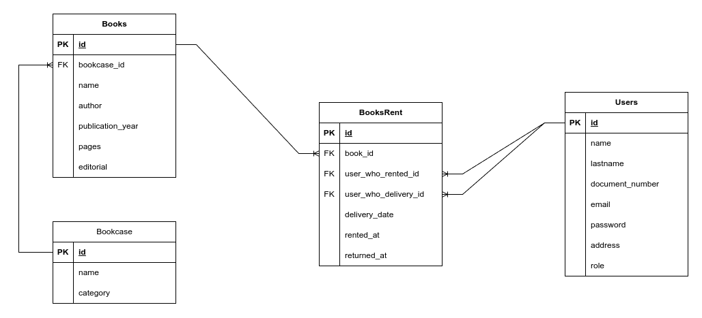

# LibraryManagement
El sistema LibraryManagement está diseñado para gestionar una biblioteca de manera eficiente, ofreciendo diferentes 
niveles de acceso y funcionalidades según los roles de los usuarios. Este sistema tiene tres roles 
principales: administrador, bibliotecario y usuario (cliente).

## Roles y Funciones

### Administrador (Admin)
El administrador tiene el control total sobre todas las funciones del sistema. Sus privilegios incluyen:

* **Acceso a todas las funciones de la aplicación:** Puede realizar cualquier operación dentro del sistema.
* **Monitorización del sistema:** Utiliza herramientas como **Actuator** para supervisar el estado del sistema.
 
### Bibliotecario
El bibliotecario tiene permisos intermedios, con la capacidad de gestionar ciertos aspectos de la biblioteca, pero con algunas restricciones:

* **Gestión de usuarios:** Puede realizar gestiones administrativas sobre los usuarios, como la busqueda de todos los 
usuarios y actualización.
* **Administración de libros:** Tiene la capacidad de administrar la colección de libros, aunque no puede crear ni eliminar libros.
* **Gestión de alquiler de libros:** Es responsable de todo el proceso de alquiler de libros, desde la asignación hasta la devolución.


### Cliente
El usuario tiene un acceso más limitado, centrado en la búsqueda de los libros disponibles en la biblioteca:

## Reglas de Alquiler
Para mantener el orden y la disponibilidad de los recursos, el sistema implementa las siguientes reglas para el alquiler de libros:

* **Límite de libros:** Un usuario puede tener alquilados hasta 3 libros al mismo tiempo.
* **Devolución pendiente:** No se permitirá el alquiler de nuevos libros si el usuario tiene un libro pendiente de 
devolución en una fecha determinada.
* No se puede alquilar un libro que ya se encuentra alquilado.

## MER



## Ejecutar contenedores
Para ejecutar los contenedores de las bases de datos Postgres y Redis, debe utilizar el siguiente comando 
en el directorio raíz del proyecto:

```shell
docker compose -f .docker/docker-compose.yml -f .docker/docker-compose.override.yml up
```

## Ejecutar migraciones
Una vez que los contenedores estén en ejecución, puede ejecutar las migraciones con el siguiente comando:
```shell
docker run -it --workdir="/project" --rm -v $PWD:/project --network=docker_library-network liquibase/liquibase --defaultsFile=db-migrations/liquidbase.properties --changelog-file=db-migrations/changelog.xml update
```
Para gestionar las migraciones, se utilizó **Liquibase**, una herramienta de código abierto que facilita el control de 
versiones de la base de datos, Permitiendo definir, aplicar y gestionar cambios en la estructura de la base de 
datos de manera controlada.

## Detalles técnicos

### Autenticación y autorización
Para la gestión de autenticación y autorización, se utilizó **Spring Security**. Esto garantiza que cada usuario solo 
tenga acceso a las funciones correspondientes a su rol. Para acceder a las peticiones, el usuario debe incluir el token 
JWT en el encabezado, el cual se genera al momento de iniciar sesión.

### Cache
El caché se administra mediante **Redis** en las secciones de la aplicación que pueden contener una gran cantidad de datos. 
Esto se hace con el fin de optimizar el rendimiento de la aplicación. Al utilizar Redis, se reduce la carga en la base 
de datos principal y se mejora la velocidad de acceso a los datos frecuentemente consultados.

### Testing
Para los test, se utilizó una base de datos en memoria **H2**. Su uso permite realizar pruebas unitarias y de integración 
sin afectar la base de datos principal, facilitando la simulación de diferentes escenarios y la validación 
de la funcionalidad del sistema en un entorno controlado.

## Documentación de API
Para ver de una manera mas detallada todos los endpoints disponibles en la API y como utilizarlos 
puede hacerlo por medio de este [Link](https://documenter.getpostman.com/view/24997642/2sA3kdBdeH),
 